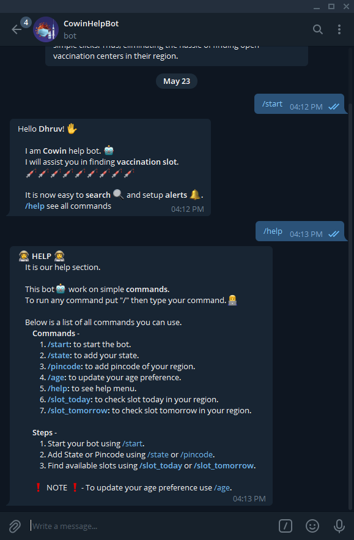

### ReadME

## Objective
The objective of this project is to create all in one telegram-bot solution for finding vaccination slots for the COVID-19 virus. 

## Description 
In this project, we have developed a CoWin help bot in order to help users in finding vaccination slots in their region.

It allows the user to find and locate vaccination centers with just a few simple clicks. Thus, eliminating the hassle of finding open vaccination centers in their region.

	
   

Operating System - Windows 10

Telegram Bot - @project_cowinbot

Softwares : 
	
	- Python 3
	
	- Telegram
	
	- Visual Studio Code
	
	
# Contributor
1. Dhruv Saini  
     . LinkedIN - https://www.linkedin.com/in/dhruv73                               
     . VideoDemonstration - https://youtu.be/iDUA5YrvDHY
     
# Requirements
	
	- Telegram: pip install python-telegram-bot
	
	- CoWin API: pip install cowin
	
	- Pandas: pip install pandas
	
	
 
 # Bot
1. Starting the bot

	

2. Help Command

	

3.  Inline Keyboard

	

3.  Wrong Command

	
	
